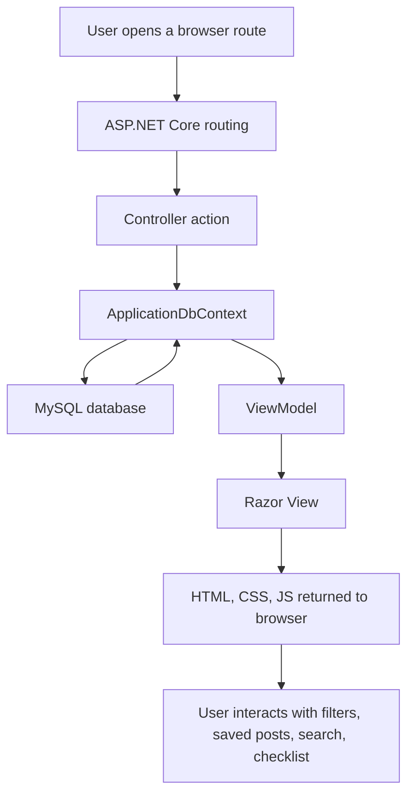
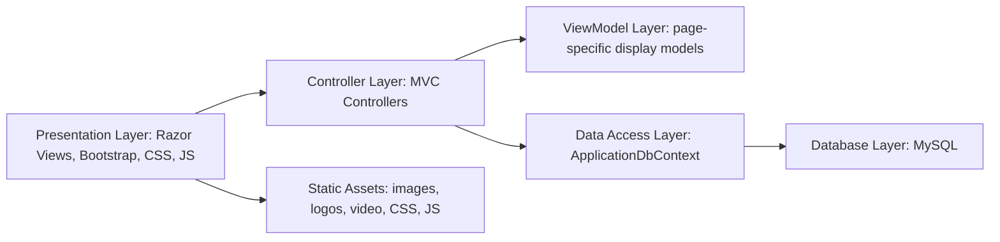
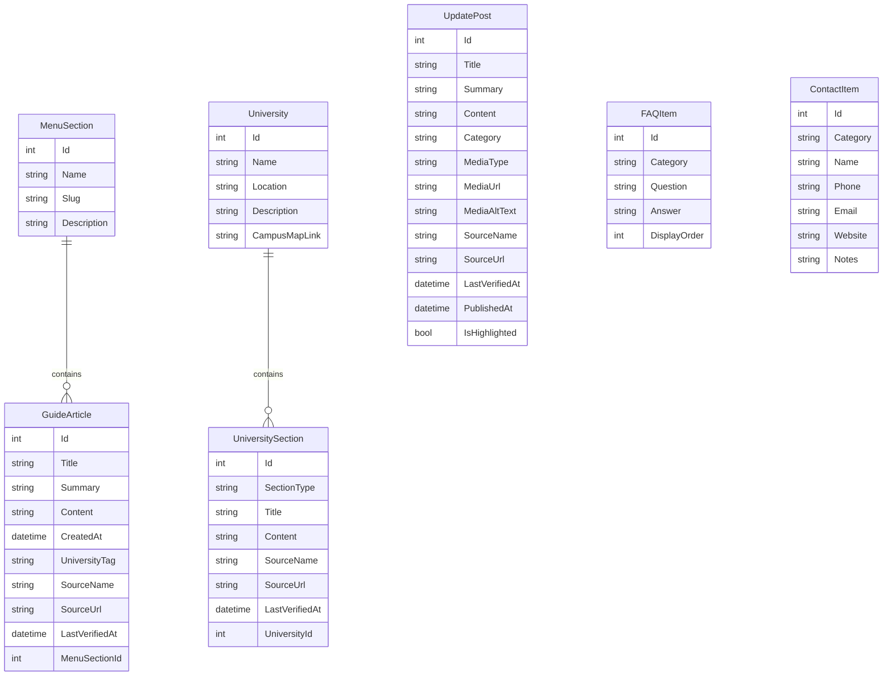

# CIS Connect Architecture Documentation

This document explains the system design, data flow, entity relationship design, and route structure for CIS Connect.

## System Overview

CIS Connect follows the ASP.NET Core MVC pattern:

- Models represent the data entities.
- Views display pages using Razor.
- Controllers receive browser requests, load data from the database, prepare ViewModels, and return pages.
- Entity Framework Core connects the application to MySQL.
- Static assets such as CSS, JavaScript, images, and videos are served from `wwwroot`.

## MVC Request Flow

## Application Layers

## Entity Relationship Diagram

## Main Data Relationships

| Relationship | Explanation |
| --- | --- |
| One `MenuSection` has many `GuideArticle` records. | Each guide page, such as Pre-Arrival or Arrival & Setup, contains multiple articles. |
| One `University` has many `UniversitySection` records. | Each university page has internal tab content such as Overview, Programs, Housing, and Fees. |
| `UpdatePost` is standalone. | Home feed posts are independent from menu guide articles. |
| `FAQItem` is standalone. | FAQ items are searchable and grouped by category. |
| `ContactItem` is standalone. | Contact records are grouped by category on the contacts page. |
| Source metadata is attached to key content. | `SourceName`, `SourceUrl`, and `LastVerifiedAt` help evaluators see where official information came from. |

## Controller Responsibility

| Controller | Responsibility |
| --- | --- |
| `UpdatesController` | Loads the Home feed and highlighted update posts. |
| `MenuController` | Loads guide pages such as Pre-Arrival, Arrival & Setup, Living in Malaysia, CIS Community, Deals, and Contacts. |
| `PostController` | Displays full post details for both update posts and guide articles. |
| `UniversitiesController` | Displays all universities, university details, and university comparison. |
| `FAQController` | Displays and searches FAQ items. |
| `SearchController` | Searches update posts and guide articles. |
| `SavedController` | Displays saved posts from browser local storage. |
| `ChecklistController` | Displays checklist items stored in browser local storage. |
| `HomeController` | Displays About and Error pages. |

## Route Map

```mermaid
flowchart TD
    A["/"] --> B["UpdatesController.Index"]
    C["/Home/About"] --> D["HomeController.About"]
    E["/Menu/PreArrival"] --> F["MenuController.PreArrival"]
    G["/Menu/ArrivalSetup"] --> H["MenuController.ArrivalSetup"]
    I["/Menu/LivingInMalaysia"] --> J["MenuController.LivingInMalaysia"]
    K["/Menu/CISCommunity"] --> L["MenuController.CISCommunity"]
    M["/Menu/Deals"] --> N["MenuController.Deals"]
    O["/Menu/Contacts"] --> P["MenuController.Contacts"]
    Q["/Universities"] --> R["UniversitiesController.Index"]
    S["/Universities/Details/{id}"] --> T["UniversitiesController.Details"]
    U["/Universities/Compare"] --> V["UniversitiesController.Compare"]
    W["/FAQ"] --> X["FAQController.Index"]
    Y["/Search"] --> Z["SearchController.Index"]
    AA["/Saved"] --> AB["SavedController.Index"]
    AC["/Checklist"] --> AD["ChecklistController.Index"]
    AE["/post/{id}"] --> AF["PostController.Details"]
```

## Frontend and Backend Connection

1. The user clicks a page link in the navigation bar.
2. ASP.NET Core routes the request to the matching controller action.
3. The controller uses `ApplicationDbContext` to query MySQL.
4. The controller prepares a ViewModel when the page needs organized display data.
5. Razor Views render HTML using the model data.
6. CSS from `wwwroot/css/site.css` controls visual design and responsiveness.
7. JavaScript from `wwwroot/js/site.js` controls filters, saved posts, checklist behavior, mobile navigation, and UI interactions.

## Local Storage Features

Saved posts and checklist progress are stored on the user's device using browser local storage.

This keeps the MVP simple because it does not require user login. However, the data is only available on the same browser and device.

## Security and Maintainability Notes

For a stronger production-ready version:

- Move database credentials out of `appsettings.json`.
- Add EF Core migrations.
- Add server-side validation for any future forms.
- Add an admin dashboard if student submissions are added.
- Add source links and last verified dates for official information.
